# Spring boot 학습 - 기본개념

## 🟩 InteliJ 설치 및 프로젝트 생성


강의에서는 spring boot 2.x버전을 강의했는데 인텔리제이에는 3.x버전만 다루는 것 같아서 차질을 대비해 [spring initializr](https://start.spring.io/)를 통해 2.x을 다운받았습니다


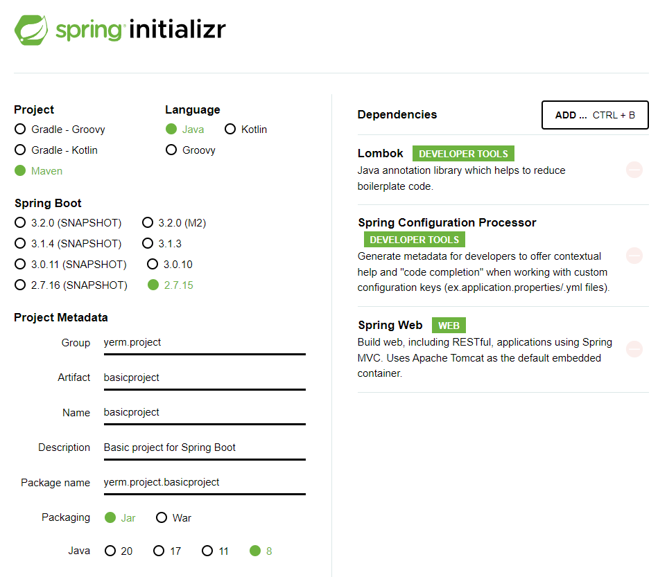


## 🟩 구조 설명

```
src
ㄴ main
	ㄴ java
		ㄴ yerm.project.basicproject
				ㄴ BasicprojectApplication
	ㄴ resources
		ㄴ static
		ㄴ templates
		ㄴ application.properties
ㄴ test
	ㄴ java
		ㄴ basicprojectApplicationTesets
```

* **src/main/java** : 자바 파일을 작성하는 공간
* **src/main/resources** : 자바 파일을 제외한 HTML, CSS, Javascript, 환경파일 등을 작성하는 공간
* **BasicprojectApplication** : 모든 프로그램에는 시작을 담당하는 파일
* static: 프로젝트의 스타일시트(.css), 자바스크립트(.js) 그리고 이미지 파일(.jpg, .png) 등을 저장하는 공간
* **templates**: HTML 파일 형태로 자바 객체와 연동되는 파일, 프로젝트의 질문 목록, 질문 상세 등의 HTML 파일을 저장

* **application.properties** : application가동을 위해 필요한 내용들, 환경 설정, DB연결 경로 등

* **src/test/java** : 프로젝트에서 작성한 파일을 테스트하기 위한 테스트 코드를 작성하는 공간

* **basicprojectApplicationTesets** : 클래스와 1:1대응하도록 테스트 클래스 생성


## 디자인 패턴

### 디자인 패턴이란?

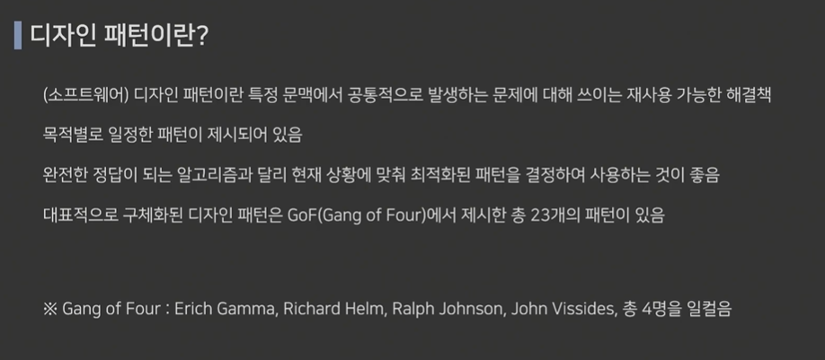

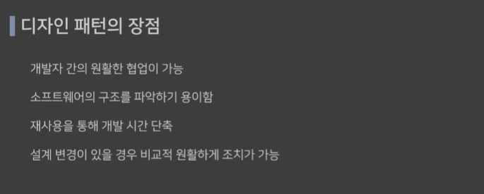


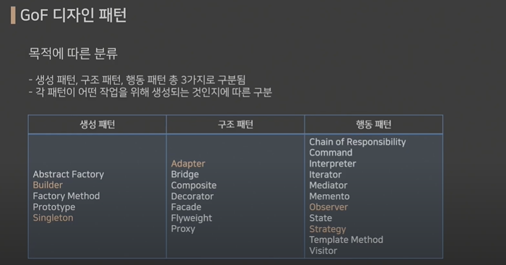


### 생성패턴

언어를 사용해봤다면 들어봤을 패턴들

**싱글톤 패턴**을 필수적으로 알아야한다 / Spring boot의 싱글톤 패턴과 조금 다르다

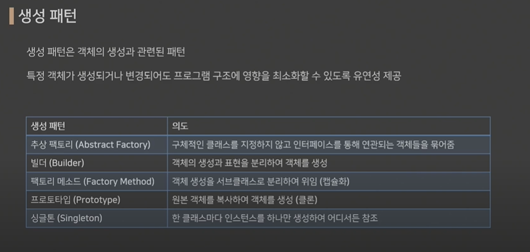


### 구조패턴

기능들이 추가될 때 기존 프로젝트 코드들에서 최소한만 변경하여 고칠 수 있도록 해주는 패턴

**어댑터, 브리지, 데코레이터, 파사드** 가 주요 패턴

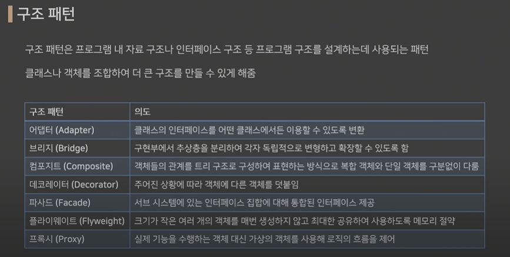


### 행동 패턴

결합도를 최소화한다 = 루즈 커플링

**전략, 반복자** 패턴이 주요 패턴

하지만 전체적인 내용을 아는 것이 중요

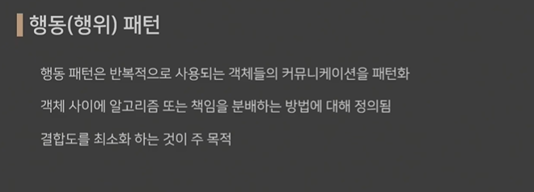

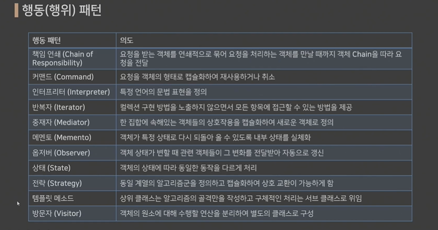


## Rest API

### API란?

응용프로그램을 통해 다른 프로그램을 제어할 수 있게 만든 인터페이스

SW적인 인터페이스를 통해 제어

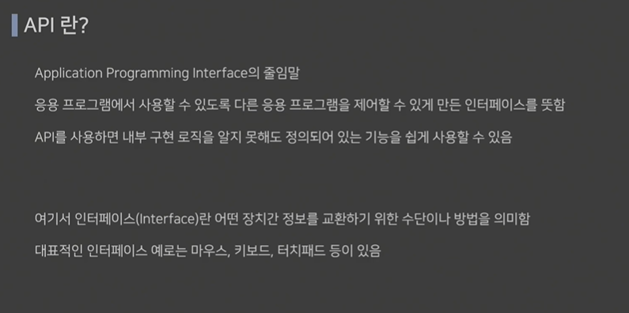


### REST란? 

자원(data)의 상태(시간, 이름 등)를 교환하는 것

HTTP Method (CRUD)를 통해 자원을 컨트롤한다


### REST 특징

* **Server-Client 구조** : 자원이 있는 쪽이 Server, 요청하는 쪽이 Client
  * 독립의 뜻 : 자원을 공유하는 교집합이 없어야한다, server와 client각각의 DB를 두고 각각 침범하지 않도록 하는것이 중요
* **Stateless** : 요청간 클라이언트 정보가 서버에 저장되지 않음
* **Cacheable**: HTTP특징인 캐싱기능을 적용
* **계층화**: 서버에서 구조에서 변경이 있어도 클라이언트에서는 자원을 받아오게만 하면 된다 (영향을 받지 않는다)
* **Code on Demand (js)**: 서버에서 클라이언트로 전달하면 바뀐 화면을 띄운다
* **인터페이스 일관성** : HTTP 프로토콜을 따르는 모든 플랫폼에서 사용 가능하게끔 설계

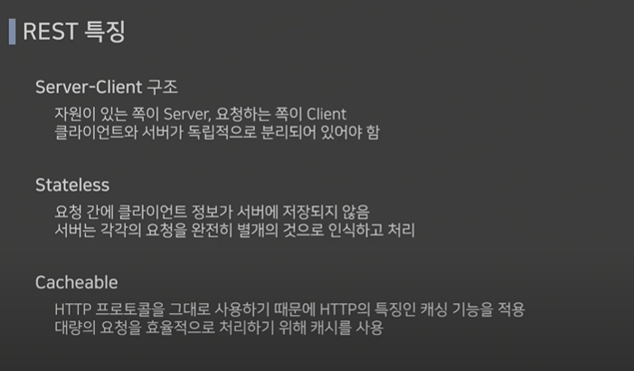

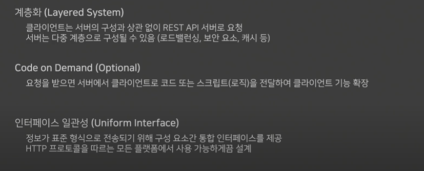


### REST 장점

* HTTP 표준 프로토콜을 사용하는 모든 플랫폼에서 호환 가능
* 서버와 클라이언트의 역할을 명확하게 분리
* 여러 서비스 설계에서 생길 수 있는 문제를 최소화


### REST API란?

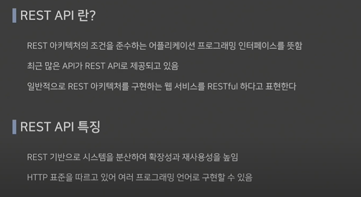


### REST API 설계 규칙

* 제일 많이 사용하고 있는 형식은 JSON형식
* around-of-studio 형태로 가독성 높이기 (언더바(_)는 사용안함 - 하이퍼링크로 잡힐 수 있기 때문)

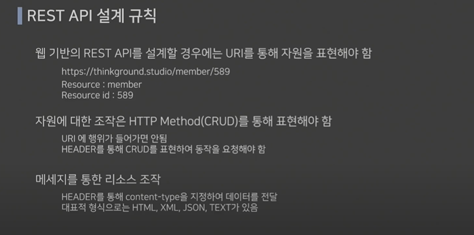

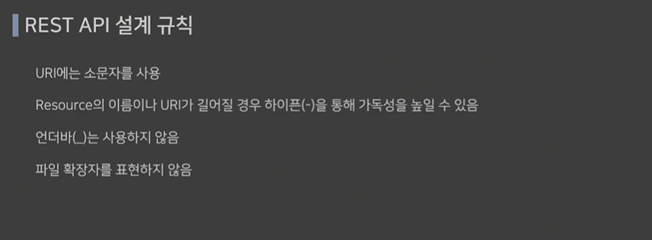


## Maven - Pom.xml 설정

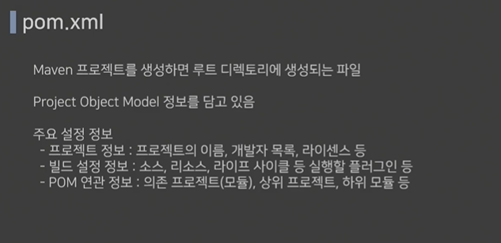


### pom 태그 설명

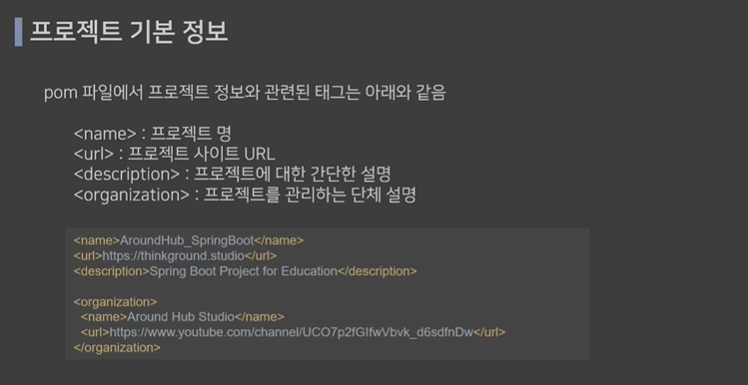


우리는 jar로 패키징 했기 때문에 jar설정

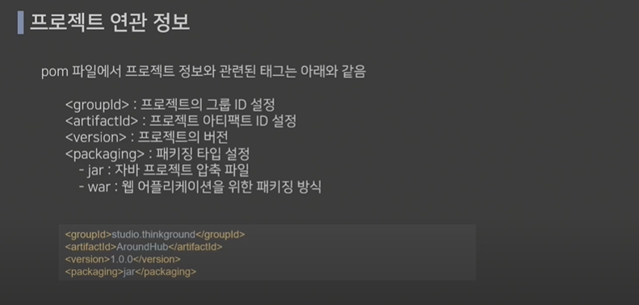


**의존 설정이 중요**

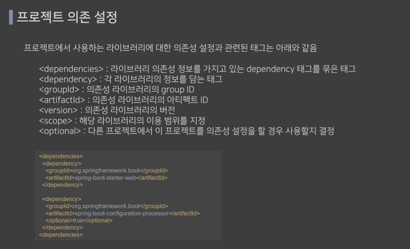


### scope 태그

>  tag에서 사용될 수 있는 설정값

**runtime** : 컴파일 시 패키징하기 위한 과정인데, 검증하지 않고 실행할 때 그대로 사용할 수 있게끔 세팅하는 것

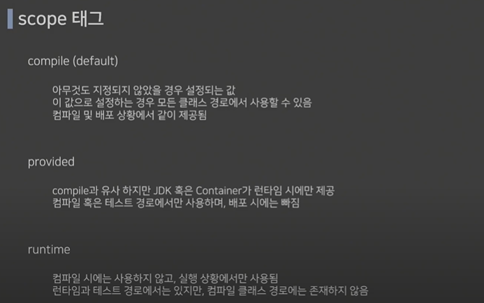

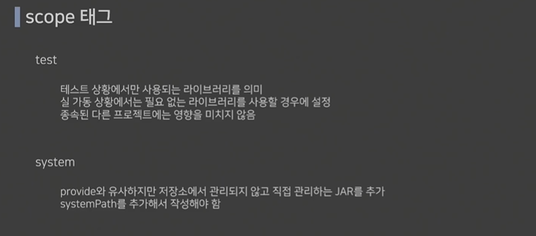


### 초기 설정되어있는 라이브러리

#### Starter

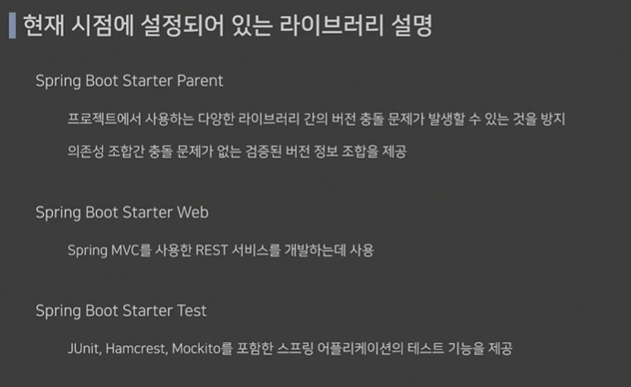


### 추가한 코드

```xml
<groupId>yerm.project</groupId>
<artifactId>basicproject</artifactId>
<version>0.0.1-SNAPSHOT</version>
<!-- 추가 -->
<packaging>jar</packaging>
```


## MVC패턴

* 모든 사용자들 요청은 컨트롤러로 받게 됨
* 어떻게 처리할 지 결정한다음에 Model(DB처리하는 영역)에 요청
* CRUD중 어떤 요청이 가면 Update된 요소들 View로서 업데이트함

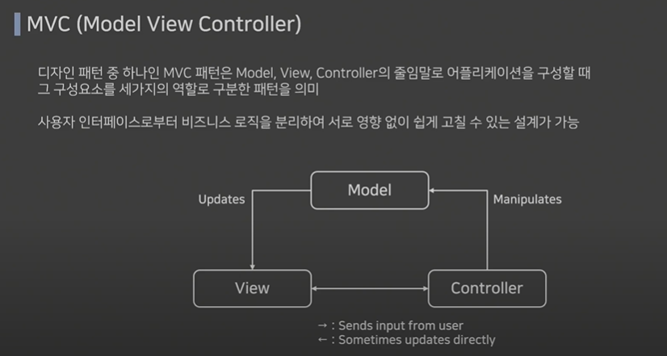


### 컨트롤러

* 모델과 뷰 사이에서 브릿지 역할 수행
* 앱의 사용자로부터 입력에 대한 응답으로 모델 및뷰를 업데이트 하는 로직 포함 
* 사용자의 요청은 모두 컨트롤러를 통해 진행됨
* 컨트롤러로 들어온 요청은 어떻게 처리할지 결정해 모델로 요청 전달
* 쇼핑몰에서 상품 검색하면 그 키워드를 컨트롤러가 받아 모델과 뷰에 적절하게 입력 처리하여 전달


### 모델

* 데이터를 처리하는 영역
* DB와 연동을 위한 DAO(Data Access Object)와 데이터 구조 표현하는 DO(Data Object)로 구성됨
  * 디자인패턴 말했듯이 정답이 아니다. 상황에 맞춰 설계를 해야함 무조건 DAO와 DO를 따를 필요는 없음
* 검색을 위한 키워드가 넘어오면 DB에서 관련된 상품의 데이터를 받아 뷰에 전달


### 뷰

* 데이터 보여주는 화면 자체의 영역
* 사용자 인터페이스(UI) 요소들이 여기에 포함되며 데이터를 각 요소에 배치함
* 뷰에서는 별도의 데이터를 보관하지 않음
* 검색 결과를 보여주기 위해 모델에서 결과 상품 리스트 데이터를 받음


### MVC 패턴 특징

* 어플리케이션 역할을 세 구간으로 나누어 설계함으로써 서로 간의 **의존성이 낮아짐**
* 각 영역이 독립적으로 구성되어 **개발자 간 분업 및 협업이 원할**해짐
* 한 영역을 업데이트 하더라도 **다른 곳에 영향을 주지 않음**


## 어노테이션

어노테이션 : 자바에서는 주석이란 뜻을 가지고 있는데, 소스코드에 추가해서 사용할 수 있는 메타 데이터의 일종이다

*  메타데이터란 애플리케이션이 처리해야할 데이터가 아니라 컴파일 과정과 실행과정에서 코드를 어떻게 처리해야하는지 알려주기 위한 추가 정보
* @를 기호 앞에 붙여 사용한다


### 어노테이션 이용시

* 컴파일러에게 코드 작성 문법 에러를 체크하도록 정보 제공
* 소프트웨어 개발 환경이 빌드나 배포시 코드를 자동으로 생성할 수 있도록 정보제공
* 런타임에 특정 기능을 실행하도록 정보 제공


#### @RestController

* @Controller에 @ResponseBody가 결합된 어노테이션

  * 두 어노테이션은 스프링 프레임워크에서 사용된다.
  * MVC아키텍처에서 컨트롤러 클래스와 메서드를 정의하고 HTTP 응답을 처리하는 데 사용된다

* @Controller : MVC 컨트롤러 클래스를 정의하는 데 사용됨

  ```java
  @Controller
  public class MyController {
      // 컨트롤러 메서드들
  }
  ```

* @ResponseBody : 스프링 MVC컨트롤러 메서드에서 HTTP 응답의 본문(body)를 작성할 때 사용된다. 

  메서드에 이 어노테이션을 붙이면 해당 메서드가 반환하는 객체나 데이터가 HTTP 응답으로 직접 전송됩니다. 

  ```java
  @Controller
  public class MyController {
      @GetMapping("/data")
      @ResponseBody
      public MyDataObject getMyData() {
          MyDataObject data = new MyDataObject();
          data.setName("John");
          data.setAge(30);
          return data;
      }
  }
  ```

  

* @ResponseBody 어노테이션을 붙이지 않아도 문자열과 JSON등을 전송할 수 있다

* View를 거치지 않고 HTTP ResponseBody에 직접 Return값을 담아 보내게 된다

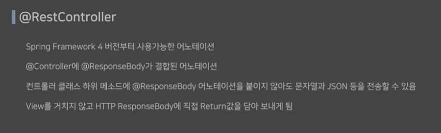


### @RequestMapping

* URL을 매핑하여 경로를 설정해 해당 메소드에서 처리
* value: url 설정
* method: GET, POST, DELETE, PATCH등 설정
* 4.3부터는 @GetMapping, @PostMapping, @DeleteMapping, @PutMapping 등으로 사용한다

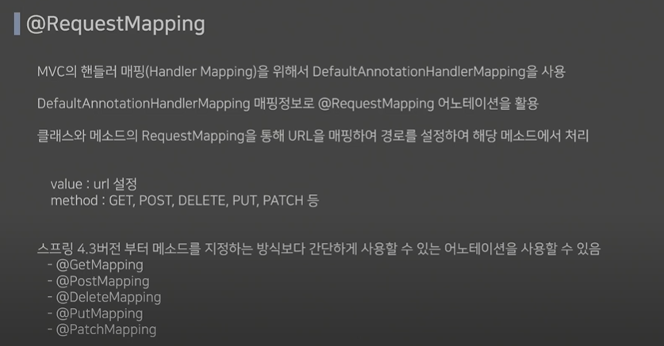

