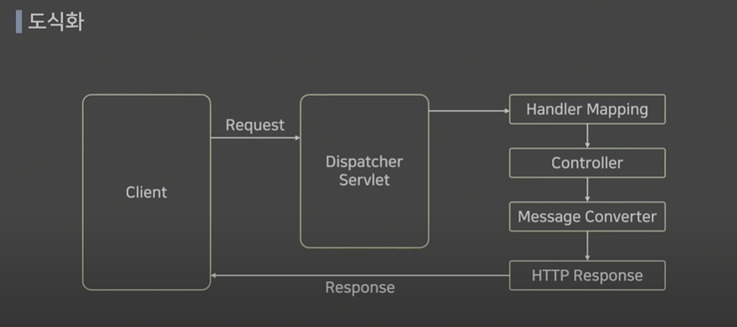

# Spring boot 학습 - 실습

> View(화면)는 다루지 않을 예정


## 1. Hello World 응답하기

> 컨트롤러를 통해서 요청을 받은 다음에 요청에 대한 응답으로 Hello World를 출력


### 원하는 결과


### 이론



* 만들어야하는 부분이 Controller부분 (Rest Controller)


#### 사용하는 어노테이션

* @ResponseController : View를 거치지 않고 HTTP ResponseBody에 직접 Return값을 담아 보내게 됨
* @RequestMapping : URL을 매핑하여 경로를 설정해 해당 메소드에서 처리
  * value와 method를 설정


### 실습

1. Chorme Store에 들어가 Talend 확장 프로그램 설치

2. src>java >yerm.project.basicproject 하위에 controller 패키지 생성하고 Hello Controller class 생성

3. 코드 작성

   ```java
   package yerm.project.basicproject.controller;
   
   import org.springframework.web.bind.annotation.RequestMapping;
   import org.springframework.web.bind.annotation.RestController;
   
   
   @RestController
   public class HelloController {
       // url 설정
       @RequestMapping(value="/hello")
   //    메소드 생성
       public String hello() {
           return "Hello World!";
       }
   }
   
   ```

4. 코드 실행 후 Talend에서 확인하기

   

 

### 결과

* 200 정상 응답 확인 
* BODY에 Hello World! 응답 확인

* HEADER : HTTP 정보 확인

  ```
  
  Content-Type:	text/plain;charset=UTF-8
  Content-Length:	12 bytes
  Date:	
  Mon, 11 Sep 2023 16:23:47 GMT
  Keep-Alive:	timeout=60
  Connection:	keep-alive
  ```

* 어떤 메소드에서든 "Hello World!"결과 값을 받기 때문에 특정 메소드를 통해서만 받을 수 있도록 `@RequestMapping(value="/hello", method = RequestMethod.GET)` 코드 변경

* @GETMapping을 이용한 최종 코드

  ```java
  import org.springframework.web.bind.annotation.GetMapping;
  import org.springframework.web.bind.annotation.RequestMapping;
  import org.springframework.web.bind.annotation.RestController;
  
  
  @RestController
  public class HelloController {
  //    @RequestMapping(value="/hello", method = RequestMethod.GET)
      @GetMapping("hello")
  //    메소드 생성
      public String hello() {
          return "Hello World!";
      }
  }
  ```

  